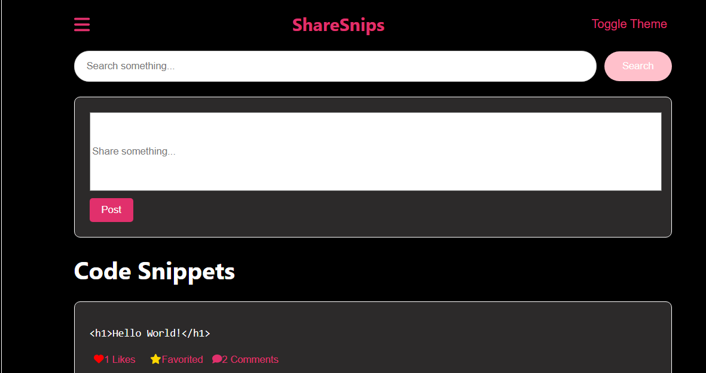

  

###

  
  
  

###

  

###

<h1 align="center">Welcome to ShareSnips👋</h1>

###

<h3 align="left">👩‍💻  About Us</h3>

###

Welcome to ShareSnips a modern and carefully built platform that builds a bridge between professional developers to anywhere as up and coming coders by allowing them to communicated with code snippets. These code snippets can be sent 1 on 1 or shared with your friends or the entire community. All your choice! This app has been designed and created with the image of the users happiness, entertainment and overall making it a useful and easy to use platform overall!  - 🔭 This has been created by @myzticx - 📚 This app is still in early stages of development - ⚡ Created and began development in late 2023!

###

<h3 align="left">🛠 Language and tools used within</h3>

###

  
  
  
  
  
  
  
  
  
  
  
  
  
  
  
  
  
  
  

To learn React, check out the [React documentation](https://reactjs.org/).
